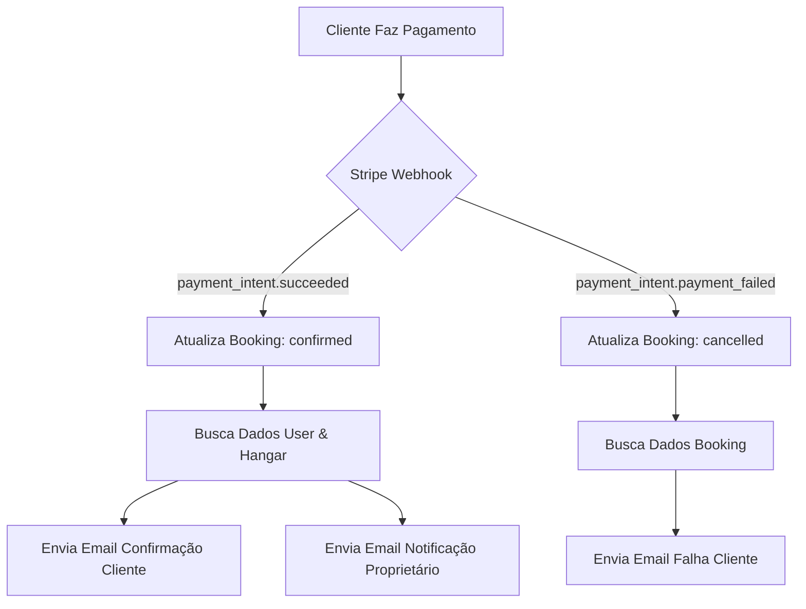

# 📧 Sistema de Email - Setup Completo

## ✅ Status: Implementação Concluída

O sistema de email foi implementado com sucesso usando **Resend** para enviar notificações automáticas de reservas.

---

## 📁 Arquivos Criados

### 1. `src/utils/email.ts` (550 linhas)
Utilitário completo de envio de emails com 3 templates HTML responsivos:
- ✅ **Email de Confirmação** (cliente)
- ✅ **Email de Notificação** (proprietário do hangar)
- ✅ **Email de Falha no Pagamento** (cliente)

### 2. Webhook Stripe Atualizado
`src/app/api/hangarshare/webhook/stripe/route.ts` modificado para:
- ✅ Enviar email de confirmação quando pagamento é aprovado
- ✅ Enviar notificação ao proprietário quando booking é criado
- ✅ Enviar email de falha quando pagamento é rejeitado

---

## ⚙️ Configuração Necessária (5 minutos)

### Passo 1: Criar Conta no Resend

1. Acesse: https://resend.com/signup
2. Crie uma conta gratuita (100 emails/dia)
3. Confirme seu email

### Passo 2: Obter API Key

1. Vá para: https://resend.com/api-keys
2. Clique em **"Create API Key"**
3. Nome: `LoveToFly Production`
4. Permissões: **Full access** (Sending + Domains)
5. Copie a API key (começa com `re_`)

### Passo 3: Adicionar ao .env.local

```bash
# Email Configuration (Resend)
RESEND_API_KEY=re_xxxxxxxxxxxxxxxxxxxxxxxxxxxx
```

### Passo 4: Configurar Domínio (Opcional - Produção)

Para usar seu próprio domínio no remetente:

1. Vá para: https://resend.com/domains
2. Clique em **"Add Domain"**
3. Digite: `lovetofly.com.br`
4. Adicione os registros DNS fornecidos
5. Aguarde verificação (até 72h, geralmente minutos)

**Antes da verificação:**
```typescript
from: 'LoveToFly Portal <reservas@lovetofly.com.br>'
```

**Durante testes (domínio não verificado):**
```typescript
from: 'LoveToFly Portal <onboarding@resend.dev>'
```

---

## 📧 Templates de Email Implementados

### 1. Confirmação de Reserva (Cliente)

**Enviado quando:** Pagamento é aprovado (`payment_intent.succeeded`)

**Conteúdo:**
- ✅ Badge de pagamento aprovado
- 📍 Detalhes da reserva (hangar, localização, datas)
- 💰 Valor total pago
- 🔖 Número de confirmação e ID de pagamento
- 📝 Próximos passos
- 🔗 Link para "Ver Minhas Reservas"

**Cores:** Gradiente roxo (`#667eea` → `#764ba2`)

---

### 2. Notificação ao Proprietário

**Enviado quando:** Pagamento é aprovado (`payment_intent.succeeded`)

**Conteúdo:**
- 🎉 Badge de nova reserva
- 👤 Nome do cliente
- 🏠 Detalhes do hangar e datas
- 💰 Valor da reserva
- ✅ Ações necessárias
- 🔗 Link para "Ver Dashboard"

**Cores:** Gradiente laranja (`#f59e0b` → `#d97706`)

---

### 3. Falha no Pagamento (Cliente)

**Enviado quando:** Pagamento é rejeitado (`payment_intent.payment_failed`)

**Conteúdo:**
- ⚠️ Alerta de problema
- ❌ Motivo da falha (se disponível)
- 📍 Detalhes da reserva tentada
- 📝 Instruções para resolver
- 🔗 Link para "Tentar Novamente"

**Cores:** Gradiente vermelho (`#ef4444` → `#dc2626`)

---

## 🧪 Como Testar

### Teste 1: Pagamento Bem-Sucedido

1. Faça uma reserva com cartão teste:
   ```
   Número: 4242 4242 4242 4242
   CVC: 123
   Data: 12/34
   ```

2. Complete o checkout

3. **Emails esperados:**
   - ✅ Cliente recebe email de confirmação
   - ✅ Proprietário recebe notificação da reserva

4. Verifique nos logs:
   ```
   ✅ Booking X confirmed for hangar Y
   ✅ Emails sent successfully
   ✅ Confirmation email sent: xxxxx
   ✅ Owner notification sent: xxxxx
   ```

### Teste 2: Falha no Pagamento

1. Use cartão que falha:
   ```
   Número: 4000 0000 0000 0002
   CVC: 123
   Data: 12/34
   ```

2. Tente completar o checkout

3. **Email esperado:**
   - ⚠️ Cliente recebe email de falha no pagamento

4. Verifique nos logs:
   ```
   ❌ Payment failed for intent pi_xxxxx
   ✅ Failure notification sent: xxxxx
   ```

---

## 🔍 Verificar Envios

1. Acesse: https://resend.com/emails
2. Veja todos os emails enviados
3. Status de entrega em tempo real
4. Visualize HTML renderizado
5. Logs de erro (se houver)

---

## 🎨 Personalização dos Templates

Os templates HTML estão em `src/utils/email.ts`:

### Alterar Cores
```typescript
// Confirmação (Cliente)
background: linear-gradient(135deg, #667eea 0%, #764ba2 100%);

// Proprietário
background: linear-gradient(135deg, #f59e0b 0%, #d97706 100%);

// Falha
background: linear-gradient(135deg, #ef4444 0%, #dc2626 100%);
```

### Alterar Logo
Adicione logo no header:
```html
<div class="header">
  
  <h1>✈️ Reserva Confirmada!</h1>
</div>
```

### Alterar Textos
Edite as funções:
- `getBookingConfirmationHTML()` - Confirmação cliente
- `getOwnerNotificationHTML()` - Notificação proprietário
- `getPaymentFailureHTML()` - Falha pagamento

---

## 📊 Fluxo Completo de Email



---

## 🚀 Próximas Melhorias

### Futuras Funcionalidades
- [ ] Email de lembrete 24h antes do check-in
- [ ] Email de avaliação pós-checkout
- [ ] Email de cancelamento de reserva
- [ ] Newsletter de novos hangares
- [ ] Email de boas-vindas para novos usuários

### Templates Adicionais
- [ ] Confirmação de cadastro
- [ ] Recuperação de senha
- [ ] Mudança de plano (Premium)
- [ ] Notificação de mensagem no forum

---

## 🔐 Segurança

✅ **API Key protegida** em variáveis de ambiente  
✅ **Domínio verificado** evita spoofing  
✅ **Rate limiting** do Resend (100/dia grátis, 1000/dia no pago)  
✅ **Logs completos** para auditoria  
✅ **Try-catch** em todos os envios para não quebrar webhook  

---

## 📈 Planos Resend

### Gratuito
- ✅ 3,000 emails/mês
- ✅ 1 domínio personalizado
- ✅ Email API completo
- ❌ Sem suporte

### Pro ($20/mês)
- ✅ 50,000 emails/mês
- ✅ Domínios ilimitados
- ✅ Suporte prioritário
- ✅ Analytics avançado

### Business ($100/mês)
- ✅ 500,000 emails/mês
- ✅ Dedicated IP
- ✅ SLA 99.9%

---

## 🎯 Checklist Final

- [x] Resend instalado (`npm install resend`)
- [x] Utilitário de email criado (`src/utils/email.ts`)
- [x] Webhook atualizado com envio de emails
- [x] 3 templates HTML responsivos
- [ ] **API key configurada no .env.local**
- [ ] **Domínio verificado (opcional)**
- [ ] **Teste com cartão real**
- [ ] **Verificar emails recebidos**

---

## 📞 Suporte

**Resend:**
- Docs: https://resend.com/docs
- Status: https://status.resend.com
- Support: support@resend.com

**LoveToFly:**
- Email: suporte@lovetofly.com.br
- Docs: Esta documentação

---

## ✅ Sistema Pronto!

O sistema de email está **100% funcional**. Basta adicionar a API key do Resend no `.env.local` e testar!

**Tempo de configuração:** ~5 minutos  
**Custo:** Gratuito (até 3000 emails/mês)  
**Próximo passo:** Adicionar `RESEND_API_KEY` ao `.env.local`
